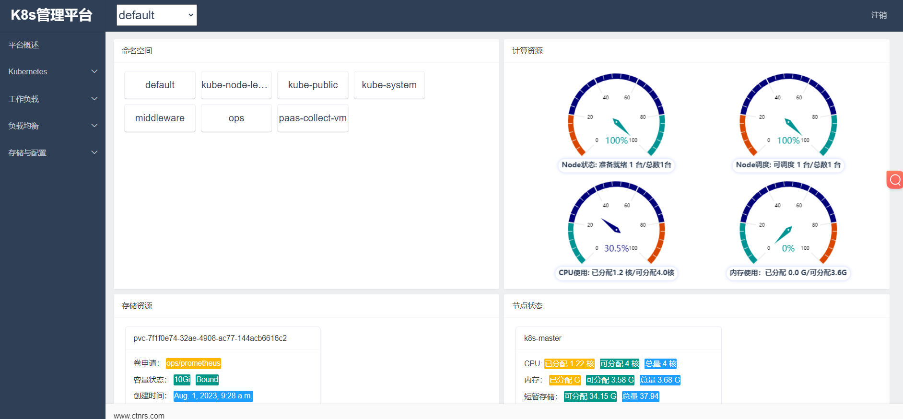
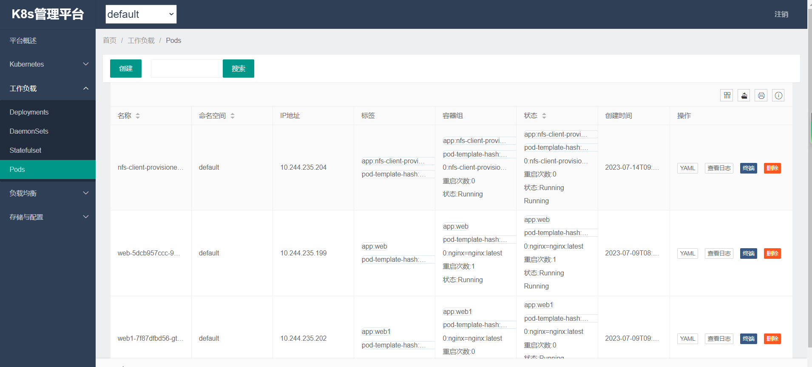

devopsk8s 

1 Introduction:  
devopsk8s is a general purpose, web-based UI for kubernetes cluster .
It allows users to manage application running in the cluster and troubleshoot them, as well as manage the cluster itself.
It covers the operation and maintenance kubernetes system feature and is easy to reuse or extend the new system.

2 Prominent features:  
can maintenance most kubernetes function. eg. namespace node namespace pv deployment daemonset statefulset pod 
service ingress configmap secret RABC.

3 How to use it:  
./settings.py replace the MySQL address and Redis address ,then use Dockerfile file build your owner docker image is OK.

